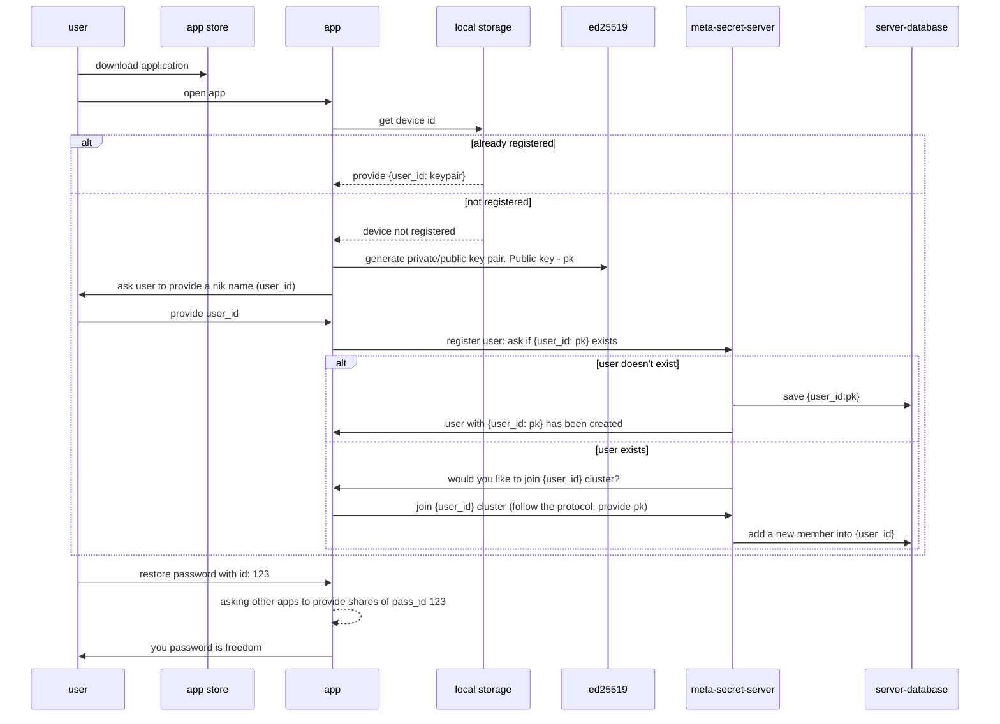
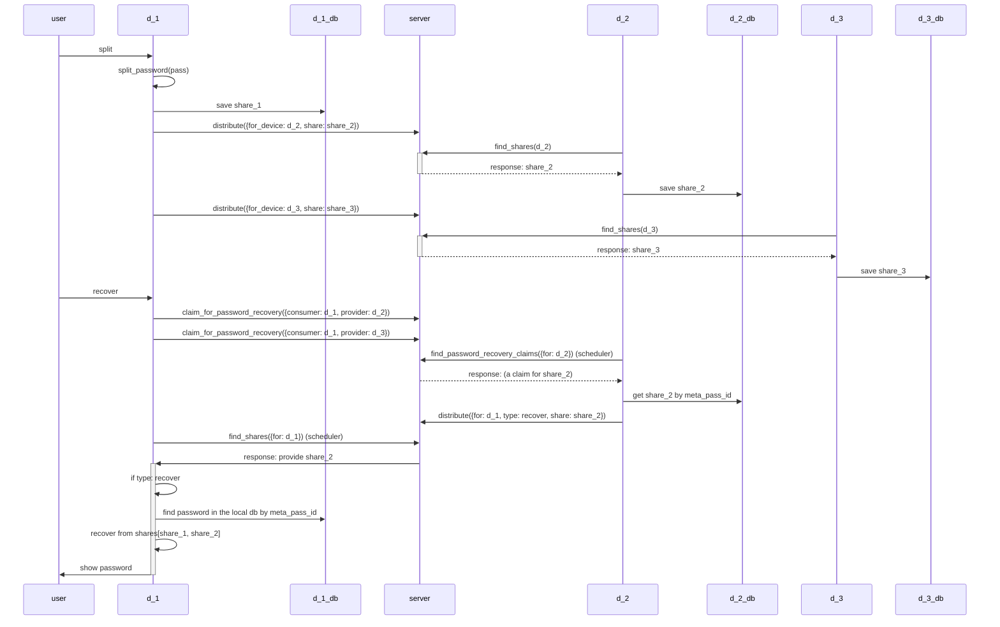

## User Registration and Cluster Formation

#### Activity Diagram

```mermaid
sequenceDiagram
    user->>app store: download application
    user->>app: open app
    app->>local storage: get device id
    alt already registered
        local storage-->>app: provide {user_id: keypair}
    else not registered
        local storage-->>app: device not registered
        app->>ed25519: generate private/public key pair. Public key - pk
        app->>user: ask user to provide a nik name (user_id)
        user->>app: provide user_id
        app ->> meta-secret-server: register user: ask if {user_id: pk} exists
        alt user doesn't exist
           meta-secret-server->>server-database: save {user_id:pk} 
           meta-secret-server->>app: user with {user_id: pk} has been created
        else user exists
            meta-secret-server->>app: would you like to join {user_id} cluster?
            app->>meta-secret-server: join {user_id} cluster (follow the protocol, provide pk)
            meta-secret-server->>server-database: add a new member into {user_id}
        end
    end
    user->>app: restore password with id: 123
    app-->>app: asking other apps to provide shares of pass_id 123
    app->>user: you password is freedom
```

## Split and Recovery Algorithm

#### Activity Diagram

```mermaid
sequenceDiagram
    
    %% Split
    user ->> d_1: split
    d_1 ->> d_1: split_password(pass)
    d_1 ->> d_1_db: save share_1

    d_1 ->> server: distribute({for_device: d_2, share: share_2})
    d_2 ->>+ server: find_shares(d_2)
    server -->>- d_2: response: share_2
    d_2 ->> d_2_db: save share_2

    d_1 ->> server: distribute({for_device: d_3, share: share_3})
    d_3 ->>+ server: find_shares(d_3)
    server -->>- d_3: response: share_3
    d_3 ->> d_3_db: save share_3


    %% Recover
    user ->> d_1: recover
    d_1 ->> server: claim_for_password_recovery({consumer: d_1, provider: d_2})
    d_1 ->> server: claim_for_password_recovery({consumer: d_1, provider: d_3})
    
    d_2 ->> server: find_password_recovery_claims({for: d_2}) (scheduler)
    server -->> d_2 : response: (a claim for share_2)
    d_2 ->> d_2_db: get share_2 by meta_pass_id
    d_2 ->> server: distribute({for: d_1, type: recover, share: share_2})

    d_1 ->> server: find_shares({for: d_1}) (scheduler)
    server ->>+ d_1: response: provide share_2
    d_1 ->> d_1: if type: recover
    d_1 ->> d_1_db: find password in the local db by meta_pass_id
    d_1 ->> d_1: recover from shares[share_1, share_2]
    d_1 ->>- user: show password
```
